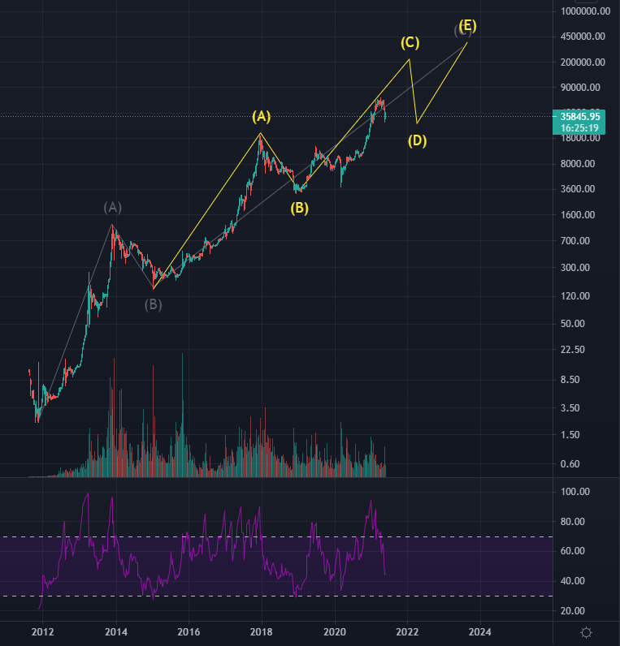
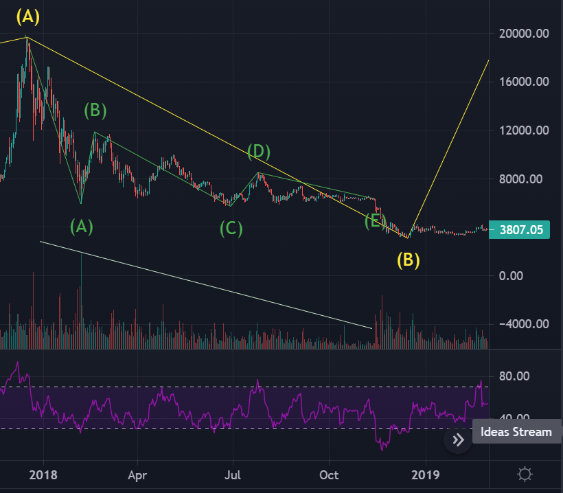
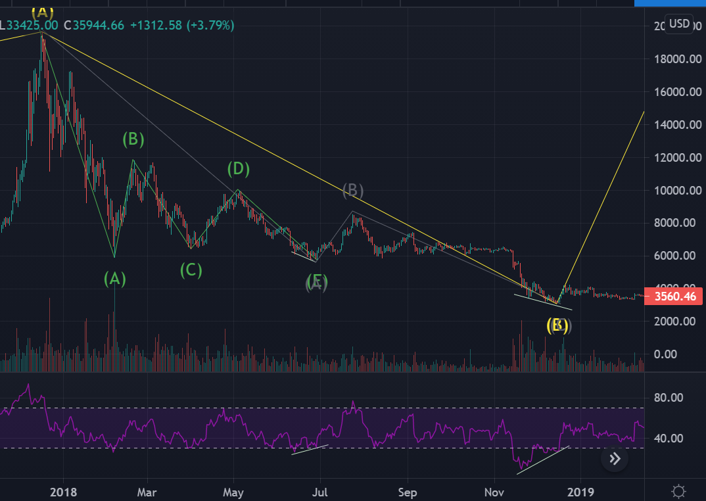

## Log Scale 현재 시황분석

- 주봉 로그차트 분석
- 슈퍼사이클 3파 내의 사이클 3파의 4파 조정 진행중
- 현재의 관점은 현재의 조정파가 내부 1파의 고점을 침범하지 않는 한 유효함
  - 비트가 **20k 이하**로 떨어지면 전체 관점 틀림
- 4파 조정이 끝났는지는 확신할 수 없지만, 올해 말 또는 내년초까지 이전고점을 갱신하는 5파가 진행되고, 큰 조정이 올 것으로 예상.

# Cycle 3-2 파 분석 (201712 ~ 201812)
- [https://www.tradingview.com/chart/Kkkg2PLe/](https://www.tradingview.com/chart/Kkkg2PLe/)

## Case1. A-B 파 조정

- 17년 12월에서 18년 12월 까지의 긴 조정이 마무리 되는 모습이다. (일봉)
- 볼륨으로 보나, 형태로 보나 아무래도 **삼각수렴**이 나온것으로 
추측
- ABC로 카운팅 해보려 했으나, 도저히 가능하지 않은듯
- 삼각 수렴후 하방돌파 이후에 상승으로 전환된것으로 보인다.
- 상승전환시, 거래량이 튀었고, 이 말은 판사람이 많은 동시에, 그 가격대를 지켜주는 사람들이 많았다는 것.
  - 추세의 전환시점에는 그 가격대를 지켜주려는 매물대가 함께 작용하여 거래량이 튄다. (패닉셀이 나오고 그 가격을 싸다고 생각하는사람들이 구매한다.)
  - 일봉상 
- 소파동 A 종료시점에서 B 파의 모양이 확연한 ABC 로 나와 하락의 종료로 볼 수 없고 재차 하락하는 모습.

## Case2. A-B 파 조정

- **일봉상 상승다이버넌스가 2번** 목격된다.
  - 첫번째 상승은, 소파동의 첫 파동을 되돌림하는부분이고, 두번째 상승다이버넌스는 조정파의 종료를 의미 한다고 추측
- 1파는 WXYXZ 5개의 파동으로 진행, 2파는 ABC 조정 이후 3파 역시, WXYXZ 로 또는 ABC로 추측된다.
- 1파에 비해 2파 조정이 너무 작다...
- **RSI 가 과매도구간을 강하게 돌파한 후 상승다이버**가 걸려야 추세가 전환되는것으로 추측할 수 있다.
